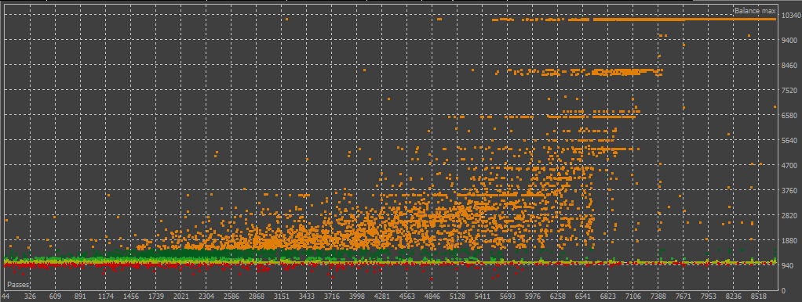
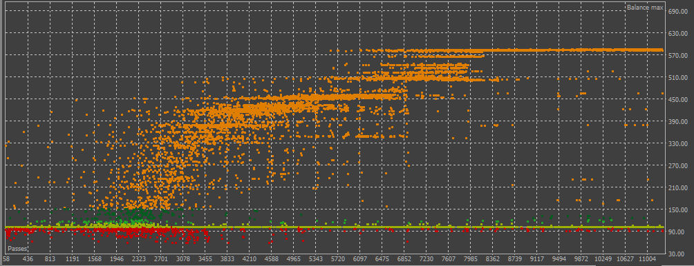

# The JulesGPTClaudeKimi-Mql5-Experiment
Status: Alpha (experimental until further notice).

### Description:
Its an experiment, to see if Jules can automate making a profitable EA. This is main branch you are reading, while [THIS](https://github.com/wiseman-timelord/JulesGPTClaude-Mql5-Experiment/branches) shows the work being done recently by Jules . As the name suggests, this is an experimental MetaTrader 5 (MT5) Expert Advisor (EA) created by Jules (primary) + Claude + GPT + Kimi K1.5/K2. It is designed to trade gold pairs (XAUUSD, GOLD) using a specific trend-following and divergence strategy. It detects general trends, checks for divergence and is supposed to place an order in general trend direction when it returns to trend direction, in order to trade in direction with logical rebound protection. The philosophy behind the strategy is, while individual waves come and go, the tide has its generally predictable direction.

### Media
Until Live testing is done, nothing is known for sure, but backtests are showing, From £1000 to £10000...



...and from £100 to £600, in 1 year...



- Also There will be the best result from both?.

## How to Use
1. Place latest `JulesExperimentalMql5_###.mq5` file into your `MQL5/Experts/` directory.
2. Open the EA script **MetaEditor**  click **"Compile"**, then close the editor.
3. Move the `.set` file provided into the "~/profiles/" folder.
4. Run MetaTrader 5 and open Strategy tester.
3. In Strategy Tester, find and select `JulesExperimentalMql5_#_##`. Set Balance to equiv =>£1000 (theoretical min £250), and put on a gold pair, set data to M1/everyTick and mode to genetic backtest and for a time period of previous 1 Year. 
4. In the EA's settings, ensure to use the provided set file for default settings, and tweak for your own intrests, though the AI recommended value ranges are there in input comments.
5. After configuration, then ensure you have CPU threads commited optimally, and click start, though this may take some time even on newer processor.
6. After Backtesting done, it show how results are doing for the EA on the pair.

### Input Params
*   `InpMagicNumber`: A unique number to identify trades opened by this EA. (1000-9999)
*   `InpMaxSpread`: The maximum allowed spread in points. Gold typical (10-50)
*   `InpDayFilter`: Dropdown menu to select which days of the week to trade.
*   `InpBaseTimeframe`: The core timeframe for the EA's logic (M15, M30, etc.).
*   `InpRsiPeriod`: The period for the RSI indicator. standard (8-21)
*   `InpDivergenceLookback`: The number of bars to look back on to find a divergence pattern. Gold optimized (20-80)
*   `InpRsiOverbought`: The RSI level above which a bearish divergence is considered valid. Gold tuned (70-80)
*   `InpRsiOversold`: The RSI level below which a bullish divergence is considered valid. Gold tuned (20-30)
*   `InpMinFractalDistance`: The minimum bars required between two fractals. Gold sensitivity (2-8)
*   `InpMaxTradesPerDay`: The maximum number of trades allowed per day. Gold frequency (1-6)
*   `InpTakeProfit`: The Take Profit in points. Only used if `InpAdaptParameters` is `false`. Gold optimized (300-2000)
*   `InpStopLossRatio`: The Stop Loss size as a ratio of the Take Profit. Gold volatility (1.2-2.5)
*   `InpCloseOnBarEnd`: If `true`, closes any open trade at the start of a new bar.
*   `InpLotSize`: The fixed lot size. Only used if `InpUseRiskPercent` is `false`. (0.01-1.0)
*   `InpUseRiskPercent`: If `true`, the EA will automatically calculate the lot size based on `InpRiskPercent`.
*   `InpRiskPercent`: The percentage of the account balance to risk on a single trade. Gold suitable (0.5-3.0)
*   `InpMaxDailyLoss`: The max percentage of daily balance to lose before stopping for the day. Gold protection (2.0-8.0)
*   `InpAdaptParameters`: Set to `true` to enable automatic TP/SL adaptation based on volatility (ATR).
*   `InpAtrPeriod`: The period for the ATR indicator. (10-21)
*   `InpAtrHistoryDays`: The number of days of history to analyze for the ATR calculation. Gold analysis (15-45)
*   `InpVolatilityMultiplier`: The multiplier for the ATR value when calculating the adapted TP. Gold calibrated (0.8-2.0)

## Notation
- Processing could take several hours even on a 20 thread processor, and each thread will require 1GB ram for each thread, for 1 year M1 Every Tick.
- OHLC may be ok if you select "Close At End Of Bar" to "True" in the EA, and it may be somewhat acurate with M1 OHLC, but personally I am going by the "Every Tick". The theory is in relevance to spikes, they will potentially break SL that in OHLC would have been still within safe zone.
- If you use this EA and gain actual profit, then you should also be supporting my work appropriately via, Patreon or Kofi, (see my profile).
- Also making some indicators, to better illustrate trend directions, [Auto-Lines](https://github.com/wiseman-timelord/Auto-LinesStatsEtc-ML) and [GoldWeekly](https://github.com/wiseman-timelord/GoldWeekly-Mt5). They will likely be developed along-side, as they enable better visual diagnosis of trends.  

## File Structure
```
.\JulesGptClaude-Mql5-Experiment_#.##.mq5 (current)
.\Archive\
.\Archive\JulesGptClaude-Mql5-Experiment_#.##.mq5 (archive)
```

### Development
- The perception is it needs to improve bad trade avoidance.
- Occasional focus on keeeping things optimized.
- Repeat checks for soundness/logic of code, ensuring Mql5 is the format.
- I still not sure if the results are trustworthy yet, live testing on demo account required.

## Credits/links
- [Google Jules](https://jules.google.com) was used, it did all the thinking, produce the bulk of the code, then bugfixed it before first response, which if any issues with, can be thrown into other AI simple, as just 1 script.
- Other AI such as, [Kimi](https://www.kimi.com/chat), [Claude](https://claude.ai/chat), [Gpt](https://chatgpt.com/), were used, mainly for fix or adaption. Repasting back into Jules, where jules would then have explained what you did in what AI, and what to do next.
